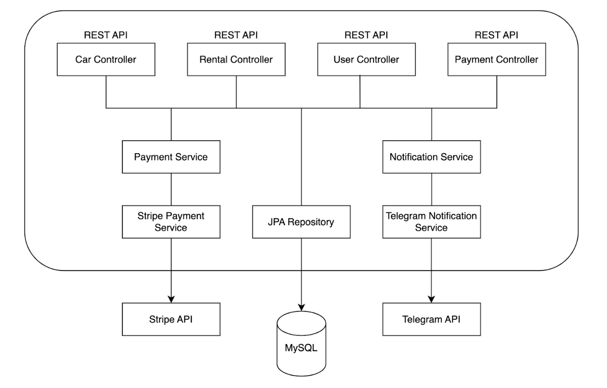
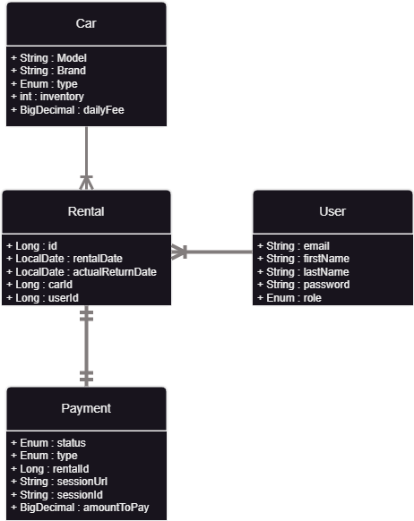

# <h1 align="center">  Car Sharing Service  </h1>
#### <h4 align="center"> `Faster than you've ever seen` </h4>

###  Introduction
`The Car Sharing Service aims to provide an efficient and user-friendly platform for renting cars. It caters to both customers and administrators, allowing customers to browse available cars, make reservations, and process payments securely, while administrators can manage car inventory, user roles, and track payments`

###  Technologies Used
`The following technologies are used to build the Car Sharing Service:`
-  **Java**: The primary programming language used for the application.
-  **Spring Boot**: A powerful framework that provides essential features for building web applications.
-  **Spring Data JPA**: Simplifies data access and persistence with JPA (Java Persistence API).
-  **Spring Security**: Enables robust and secure authentication and authorization mechanisms.
-  **Swagger**: Provides API documentation.
-  **MySQL**: The database management system used for data storage.
-  **Telegram API**: Used to send notifications to administrators via Telegram.
-   **Docker**: Used for containerization of the application and database.
-  **Stripe API**: Integrated with Stripe for secure payment processing.
-  **Lombok**: Reduces boilerplate code with annotations.
-  **MapStruct**: Simplifies object mapping between DTOs and entities.

###  Getting Started
`Before running the Car Sharing Service, ensure you have the following installed:`
-  Java Development Kit (JDK)
-  Docker and Docker Compose

`Follow the steps below to install:`
1. Clone the repository from GitHub and navigate to the project directory.
2. Create a `.env` file with the necessary environment variables. (See `.env.sample` for a sample.)
3. Run the following command to build and start the Docker containers:
   `docker-compose up --build`.
4. The application should now be running at `http://localhost:8080`.

###  Project architecture:

###  Database structure:
#### <h4 align="center">  </h4>

###  API Endpoints
`The Car Sharing Service provides the following API endpoints:`

<!-- Fill in the details for each endpoint as per your project's requirements -->

| **HTTP method** | **Endpoint**                   | **Role**   | **Function**                                     |
|:----------------|:-------------------------------|------------|:-------------------------------------------------|
| POST            | /register                      | ALL        | Register a new user.                            |
| POST            | /login                         | ALL        | Get JWT tokens for authentication.              |
| PUT             | /users/{id}/role               | ADMIN      | Update user role.                               |
| GET             | /users/me                      | ALL        | Get current user's profile info.                |
| PUT             | /users/me                      | ALL        | Update current user's profile info.             |
| POST            | /cars                          | ADMIN      | Add a new car.                                  |
| GET             | /cars                          | ALL        | Get a list of all cars.                         |
| GET             | /cars/{id}                     | ALL        | Get detailed information about a car.           |
| PATCH           | /cars/{id}                     | ADMIN      | Update a car's information.                     |
| DELETE          | /cars/{id}                     | ADMIN      | Delete a car.                                   |
| POST            | /rentals                       | ADMIN/USER        | Add a new rental.                        |
| GET             | /rentals                       | ADMIN/USER | Get rentals by user ID and rental status.       |
| GET             | /rentals/{id}                  | ADMIN/USER | Get specific rental by ID.                      |
| POST            | /rentals/{id}/return           | ADMIN/USER | Set actual return date for a rental.            |
| POST            | /payments                      | ADMIN/USER | Create a payment session for a rental.          |
| GET             | /payments                      | ADMIN/USER | Get payments by user ID.                        |
| GET             | /payments/my                   | USER       | Get payments for current user.                        |
| GET             | /payments/success              | ALL        | Endpoint for handling successful Stripe payments. |
| GET             | /payments/cancel               | ALL        | Endpoint for handling canceled Stripe payments.  |

###  Telegram Notifications
`The Car Sharing Service sends Telegram notifications for the following events:`
- New rental created: Notifications are sent to all service administrators.
- Overdue rental: If a rental is overdue (return date is in the past, and the car is still not returned), notifications are sent to all service administrators.

###  Contribution Guidelines
`We welcome contributions to this project:`

Please create a new branch for each feature or bug fix and submit a pull request to the `main` branch. All PRs must be reviewed and approved by at least two team members before merging.
